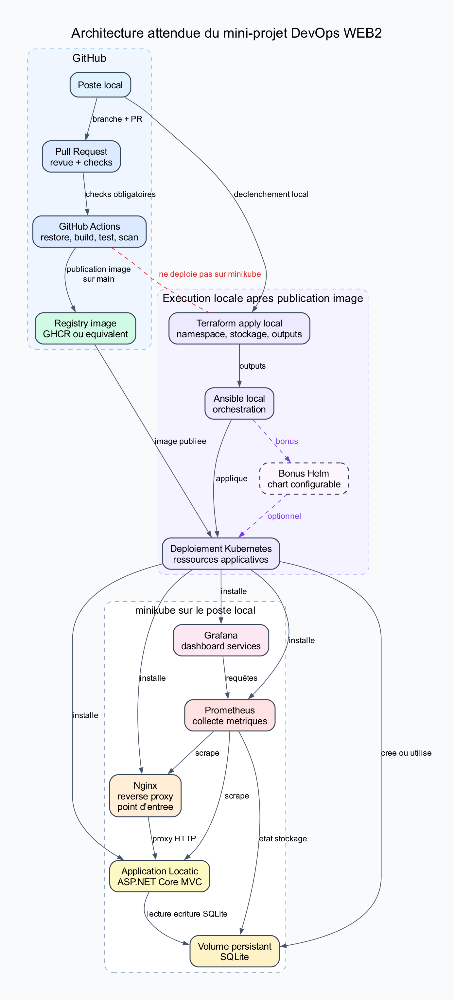

# Locatic DevOps — Mini-projet WEB2

Chaîne DevOps complète autour de l'application **Locatic** (ASP.NET Core MVC, SQLite) :
Git professionnel → CI GitHub Actions → image Docker publiée → déploiement local
**Terraform + Ansible** sur **minikube**, derrière **Nginx**, supervisé par **Prometheus + Grafana**.

> Ce dépôt reprend le projet de POO **Locatic** (application de location de voitures) comme base
> métier et y ajoute toute la couche DevOps. Le code applicatif d'origine se trouve dans [`app/`](app/).

## Architecture cible



- **GitHub** : code, Pull Requests, checks, publication de l'image (GHCR). **Ne déploie pas** sur minikube.
- **Terraform** : prépare l'infra locale (namespace, volume persistant SQLite, outputs).
- **Ansible** : orchestre le déploiement local depuis le poste (récupère les outputs Terraform, applique K8s / release Helm).
- **Kubernetes (minikube)** : Nginx (reverse proxy, point d'entrée) → App Locatic → volume persistant SQLite.
- **Monitoring** : Prometheus scrape les services, Grafana affiche les dashboards.

> ⚠️ Le pipeline GitHub **s'arrête après la publication de l'image**. Le déploiement sur minikube
> est déclenché **localement** via Terraform puis Ansible.

## Structure du dépôt

```
locatic-devops/
├── app/            # Application Locatic (ASP.NET Core MVC, EF Core, SQLite) + tests
├── .github/        # Workflows GitHub Actions (CI : build, test, scan, publish)
├── infra/terraform # Infrastructure locale (namespace, PVC SQLite, outputs)
├── ansible/        # Playbook d'orchestration du déploiement local
├── k8s/            # Manifests Kubernetes (base + overlays)
├── helm/           # Chart Helm configurable (bonus, utilisé par Ansible)
├── monitoring/     # Prometheus + Grafana (dashboards, alertes)
└── docs/           # Documentation détaillée (voir ci-dessous)
```

## Démarrage rapide

```bash
# 1. Lancer l'app en local (dev)
cd app && dotnet run --project src/Locatic.Web

# 2. Construire l'image Docker
docker build -t locatic:local -f app/Dockerfile app

# 3. Déployer sur minikube (après publication de l'image)
cd infra/terraform && terraform init && terraform apply
cd ../../ansible && ansible-playbook deploy.yml
```

Détails complets dans [`docs/deploiement-local.md`](docs/deploiement-local.md).

## Documentation

| Doc | Contenu |
| --- | --- |
| [docs/architecture.md](docs/architecture.md) | Architecture, rôle de chaque composant |
| [docs/ci-cd.md](docs/ci-cd.md) | Branches, PR, checks, jobs du pipeline, limites |
| [docs/deploiement-local.md](docs/deploiement-local.md) | Ordre exact des actions locales |
| [docs/terraform.md](docs/terraform.md) | Ressources, variables, outputs, état |
| [docs/ansible.md](docs/ansible.md) | Rôle du playbook, étapes, dépendance aux outputs TF |
| [docs/kubernetes.md](docs/kubernetes.md) | Ressources K8s, services, stockage, Nginx |
| [docs/helm.md](docs/helm.md) | Chart, valeurs configurables, release |
| [docs/monitoring.md](docs/monitoring.md) | Services monitorés, métriques, accès, dashboards |
| [docs/exploitation.md](docs/exploitation.md) | Vérifs post-déploiement, logs, rollback, diagnostic |
| [docs/preuves/](docs/preuves/) | Captures et logs des étapes clés |

## Organisation de l'équipe

Le travail est découpé en **3 lots** — voir **[PLAN-EQUIPE.md](PLAN-EQUIPE.md)**.

> Tous les bonus (Helm, alertes, dashboards comparatifs, rollback, pipeline séparé) sont **obligatoires** sur ce projet.
